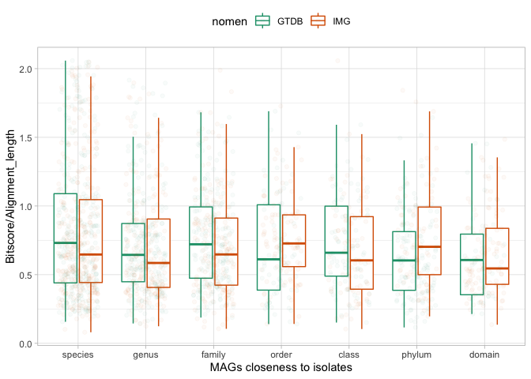
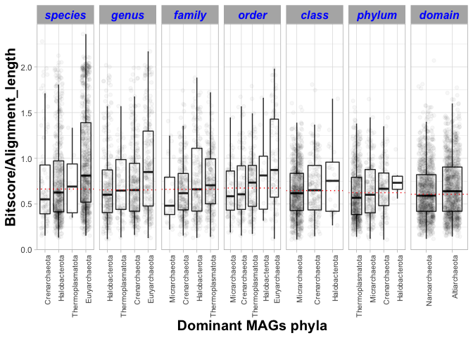
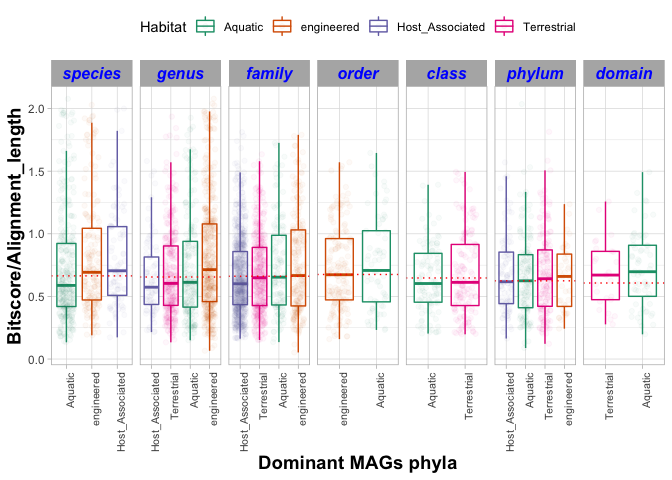

Iyanu finalproject
================

**Class project title: Quantifying the Genomic novelty and Taxonomic
distance between Archaea MAGs and Isolates**

Most studies relating to microbial diversity are challenging to carry
out in laboratory settings because most microbes cannot be cultured in
wet labs (Lloyd et al., 2018; Rinke et al., 2013). These
Phylogenetically diverse uncultured microbes dominate most of the
Earth’s environments and the increasing collection of metagenomes and
reconstruction of metagenome-assembled genomes (MAGs) from the Earth
microbiomes has widened the scope for discovering novel genes with
potential metabolic function (IMG/M Data Consortium et al., 2021).
However, the degree of phylogenetic divergence of uncultured microbes
from the cultured ones may not reflect the quantity of novel genes
across different taxa or capture more novelty range across different
environments (Lloyd et al., 2018). Sequence similarity searching using
NCBI tools such as BLAST is one way to determine and quantify the
identities of microbes by comparing their sequences to their closest
cultured relatives (Lloyd et al., 2018). This search reports a
similarity score (Bit score) where the increase in Bit score indicates
increase in sequence similarity (Pearson, 2013; Weisman et al., 2020).
Homologs descend from common evolutionary ancestry, and homologs
detected only within a taxa level, such as species, are referred to as
novel or taxonomy restricted genes (Weisman et al., 2020). Here, we
applied a sequence similarity search approach to analyze the in silico
genomic novelty present in the recent reconstructed uncultivated archaea

**Unique taxa calculation using the GTDB RefSeq**

``` r
library(tidyverse)
library(ggplot2)
theme_set(
  theme_light() + theme(legend.position = "top")
)
arc_gtdb <- read.csv("ar122_taxonomy_r89.tsv", header = FALSE) # file containing the isolate taxonomy
mag_tax <- read.csv("genome_metadata.tsv", sep = "\t") # file containing the mag taxonomy
diamond_bitscore <- read.csv("Bitscore_file.csv")
# Adding header to the taxa file
names(arc_gtdb)<-"taxa_arc"
# function to split taxonomy files  into separate columns
reformat_taxonomy<-function(x){gsub("[a-z]__","",x)}
# splitting the mag_taxonomy file  into separate columns
mag_tax_split <-mag_tax %>%
  select(genome_id, otu_id, habitat, ecosystem, ecosystem_category, ecosystem_type) %>%
  mutate(ecosystem =reformat_taxonomy(ecosystem)) %>% 
  separate(col = ecosystem,sep=';',into = c("domain",'phylum','class','order','family','genus','species'))

# Separating the mag tax files into archae and bacteria
arc_mag_tax <- filter(mag_tax_split, domain == "Archaea")
bac_mag_tax <- filter(mag_tax_split, domain == "Bacteria")


# splitting the arc_gtdb into separate columns
arc_gtdb <- arc_gtdb %>%
  mutate(taxa_arc=reformat_taxonomy(taxa_arc))%>%
  separate(col = taxa_arc, sep= ';', into = c("domain", "phylum", "class","order", "family", "genus", "species"))
arc_gtdb_split<-arc_gtdb %>%
  separate(col=domain, sep = '\t', into = c("IDs","domain"))

# Splitting  the RefSeq data archea(GCF) in the arc_gtdb 
cultured_arc_gtdb <-filter(arc_gtdb_split, grepl("RS_GCF", IDs))

# extracting unique_arc_cultured taxa
unique.cultured.arc.species <- unique(cultured_arc_gtdb$species)
unique.cultured.arc.genus <- unique(cultured_arc_gtdb$genus)
unique.cultured.arc.family <- unique(cultured_arc_gtdb$family)
unique.cultured.arc.order <- unique(cultured_arc_gtdb$order)
unique.cultured.arc.class <- unique(cultured_arc_gtdb$class)
unique.cultured.arc.phylum <- unique(cultured_arc_gtdb$phylum)
unique.cultured.arc.domain <- unique(cultured_arc_gtdb$domain)

# calculating the species rank 
arc_mag0 <- arc_mag_tax %>%
  filter(grepl("GCF", species))%>%
  mutate(cultured_level = "species")%>%
  mutate(taxonomic_dist = 0)

# filter without no species
arc_mag_no_species <- filter(arc_mag_tax, ! grepl("GCF", species))

## unique genus rank

arc_mag1<-arc_mag_no_species %>%
  filter(!species %in% unique.cultured.arc.species) %>%
  filter(genus %in% unique.cultured.arc.genus) %>%
  mutate(taxonomic_dist=1)%>%
  mutate(cultured_level= "genus")


## unique family rank
arc_mag2<-arc_mag_no_species %>%
  filter(!genus %in% unique.cultured.arc.genus) %>%
  filter(family %in% unique.cultured.arc.family) %>%
  mutate(taxonomic_dist=2)%>%
  mutate(cultured_level= "family")

# unique order rank
arc_mag3<-arc_mag_no_species %>%
  filter(!genus %in% unique.cultured.arc.genus) %>%
  filter(!family %in% unique.cultured.arc.family) %>%
  filter(order %in% unique.cultured.arc.order) %>%
  mutate(taxonomic_dist=3)%>%
  mutate(cultured_level= "order")

#  unique class rank
arc_mag4<-arc_mag_no_species %>%
  filter(!genus %in% unique.cultured.arc.genus) %>%
  filter(!family %in% unique.cultured.arc.family) %>%
  filter(!order %in% unique.cultured.arc.order) %>%
  filter(class %in% unique.cultured.arc.class) %>%
  mutate(taxonomic_dist=4)%>%
  mutate(cultured_level= "class")

## unique phylum rank
arc_mag5<-arc_mag_no_species%>%
  filter(!genus %in% unique.cultured.arc.genus) %>%
  filter(!family %in% unique.cultured.arc.family) %>%
  filter(!order %in% unique.cultured.arc.order) %>%
  filter(!class %in% unique.cultured.arc.class) %>%
  filter(phylum %in% unique.cultured.arc.phylum) %>%
  mutate(taxonomic_dist=5)%>%
  mutate(cultured_level= "phylum")

## unique domain rank
arc_mag6<-arc_mag_no_species%>%
  filter(!genus %in% unique.cultured.arc.genus) %>%
  filter(!family %in% unique.cultured.arc.family) %>%
  filter(!order %in% unique.cultured.arc.order) %>%
  filter(!class %in% unique.cultured.arc.class) %>%
  filter(!phylum %in% unique.cultured.arc.phylum) %>%
  filter(domain %in% unique.cultured.arc.domain) %>%
  mutate(taxonomic_dist=6)%>%
  mutate(cultured_level= "domain")

# combining all the taxa ranks 
unique_arc_taxa <- rbind(arc_mag0,arc_mag1,arc_mag2,arc_mag3,arc_mag4,arc_mag5, arc_mag6)
# Merging all the data to the bitscore data( diammond_bitscores)
diamond_unique_arc_gtdb <-diamond_bitscore %>%
  merge(unique_arc_taxa, by="genome_id")
```

**Unique taxa calculation Using the IMG isolates group**

``` r
arc_iso_all <- read.csv("arc_iso_all.csv") # isolate file 

# extracting unique_arc_cultured taxa 
unique.iso.arc.species <- unique(arc_iso_all$Species)
unique.iso.arc.genus <- unique(arc_iso_all$Genus)
unique.iso.arc.family <- unique(arc_iso_all$Family)
unique.iso.arc.order <- unique(arc_iso_all$Order)
unique.iso.arc.class <- unique(arc_iso_all$Class)
unique.iso.arc.phylum <- unique(arc_iso_all$Phylum)
unique.iso.arc.domain <- unique(arc_iso_all$Domain)

# unique species
arc_iso0 <- arc_mag_tax %>%
  filter(grepl("GCF", species))%>%
  mutate(cultured_level = "species")%>%
  mutate(taxonomic_dist = 0)

# filter without no  unique species
arc_mag_no_species <- filter(arc_mag_tax, ! grepl("GCF", species))


# unique genus rank

arc_iso1<-arc_mag_no_species %>%
  filter(!species %in% unique.iso.arc.species) %>%
  filter(genus %in% unique.iso.arc.genus) %>%
  mutate(taxonomic_dist=1)%>%
  mutate(cultured_level= "genus")

# unique family rank
arc_iso2<-arc_mag_no_species %>%
  filter(!genus %in% unique.iso.arc.genus) %>%
  filter(family %in% unique.iso.arc.family) %>%
  mutate(taxonomic_dist=2)%>%
  mutate(cultured_level= "family")


# unique order rank
arc_iso3<-arc_mag_no_species %>%
  filter(!genus %in% unique.iso.arc.genus) %>%
  filter(!family %in% unique.iso.arc.family) %>%
  filter(order %in% unique.iso.arc.order) %>%
  mutate(taxonomic_dist=3)%>%
  mutate(cultured_level= "order")

# unique class rank
arc_iso4<-arc_mag_no_species %>%
  filter(!genus %in% unique.iso.arc.genus) %>%
  filter(!family %in% unique.iso.arc.family) %>%
  filter(!order %in% unique.iso.arc.order) %>%
  filter(class %in% unique.iso.arc.class) %>%
  mutate(taxonomic_dist=4)%>%
  mutate(cultured_level= "class")

# unique phylum rank
arc_iso5<-arc_mag_no_species%>%
  filter(!genus %in% unique.iso.arc.genus) %>%
  filter(!family %in% unique.iso.arc.family) %>%
  filter(!order %in% unique.iso.arc.order) %>%
  filter(!class %in% unique.iso.arc.class) %>%
  filter(phylum %in% unique.iso.arc.phylum) %>%
  mutate(taxonomic_dist=5)%>%
  mutate(cultured_level= "phylum")

# unique domain rank
arc_iso6<-arc_mag_no_species%>%
  filter(!genus %in% unique.iso.arc.genus) %>%
  filter(!family %in% unique.iso.arc.family) %>%
  filter(!order %in% unique.iso.arc.order) %>%
  filter(!class %in% unique.iso.arc.class) %>%
  filter(!phylum %in% unique.iso.arc.phylum) %>%
  filter(domain %in% unique.iso.arc.domain) %>%
  mutate(taxonomic_dist=6)%>%
  mutate(cultured_level= "domain")


# combining all the data together
unique_arc_iso_all <- rbind(arc_iso0,arc_iso1,arc_iso2,arc_iso3,arc_iso4,arc_iso5, arc_iso6)

# merging it with the bitscore data
diamond_unique_arc_img <-diamond_bitscore %>%
  merge(unique_arc_iso_all, by="genome_id")
```

**Exploring and Visualizing the data from the two unique taxa
classifications(GTDB and IMG)**

``` r
# Normalize the bit scores( Bit scores/ Alignment length)
diamond_unique_arc_gtdb <- diamond_unique_arc_gtdb %>%
  mutate(norm_bitscore = Bit_score/Alignment_Length)
diamond_unique_arc_img <- diamond_unique_arc_img %>%
  mutate(norm_bitscore = Bit_score/Alignment_Length)

# assign the database classification 
diamond_unique_arc_gtdb$nomen<-"GTDB"
diamond_unique_arc_img$nomen<-"IMG"

# create 1000 samples and merge the samples from each dataset  together
unique_gtdb_samp <-  diamond_unique_arc_gtdb[sample(nrow(diamond_unique_arc_gtdb), 1000), ]
unique_img_samp <-  diamond_unique_arc_img[sample(nrow(diamond_unique_arc_img), 1000), ]
unique_gtdb_img <- rbind(unique_gtdb_samp, unique_img_samp)
unique_gtdb_img$cultured_level<-factor(unique_gtdb_img$cultured_level, levels=c("species","genus","family","order","class","phylum","domain"))

p <- ggplot(unique_gtdb_img, aes(x = cultured_level, y = norm_bitscore, color = nomen)) +
  geom_boxplot(outlier.shape = NA) +
  geom_point(position = position_jitter(width = 0.3, height = 0), alpha = 0.03)+
  scale_color_brewer(palette = "Dark2")+
  ylab("Bitscore/Alignment_length")+
  xlab("MAGs closeness to isolates")

print(p)
```

<!-- -->

``` r
# Relationship between taxonomic distance and each unique tqxa calculation(gtdb and img)

ggplot(data = unique_gtdb_img, aes(x = taxonomic_dist, y = norm_bitscore, color = nomen))+
  geom_point(alpha = 0.3) +
  geom_smooth( method =  "lm")+
  scale_color_brewer(palette = "Dark2")+
  ylab("Bitscore/Alignment_length")+
  xlab("Taxonomic dist. to closest isolates")
```

<!-- -->

``` r
# summarizing the regression model of both unique taxa classifications
model_gtdb = lm(data = unique_gtdb_samp, formula = norm_bitscore ~ taxonomic_dist)
summary(model_gtdb)
```

    ## 
    ## Call:
    ## lm(formula = norm_bitscore ~ taxonomic_dist, data = unique_gtdb_samp)
    ## 
    ## Residuals:
    ##     Min      1Q  Median      3Q     Max 
    ## -0.6630 -0.3111 -0.0771  0.2323  1.2387 
    ## 
    ## Coefficients:
    ##                 Estimate Std. Error t value Pr(>|t|)    
    ## (Intercept)     0.819785   0.018737  43.752  < 2e-16 ***
    ## taxonomic_dist -0.033653   0.006753  -4.984 7.35e-07 ***
    ## ---
    ## Signif. codes:  0 '***' 0.001 '**' 0.01 '*' 0.05 '.' 0.1 ' ' 1
    ## 
    ## Residual standard error: 0.4028 on 998 degrees of freedom
    ## Multiple R-squared:  0.02428,    Adjusted R-squared:  0.0233 
    ## F-statistic: 24.84 on 1 and 998 DF,  p-value: 7.353e-07

``` r
model_img = lm(data = unique_img_samp, formula = norm_bitscore ~ taxonomic_dist)
summary(model_img)
```

    ## 
    ## Call:
    ## lm(formula = norm_bitscore ~ taxonomic_dist, data = unique_img_samp)
    ## 
    ## Residuals:
    ##      Min       1Q   Median       3Q      Max 
    ## -0.69736 -0.30584 -0.09478  0.21021  1.35214 
    ## 
    ## Coefficients:
    ##                 Estimate Std. Error t value Pr(>|t|)    
    ## (Intercept)     0.777920   0.018161  42.835   <2e-16 ***
    ## taxonomic_dist -0.018092   0.006288  -2.877   0.0041 ** 
    ## ---
    ## Signif. codes:  0 '***' 0.001 '**' 0.01 '*' 0.05 '.' 0.1 ' ' 1
    ## 
    ## Residual standard error: 0.4005 on 998 degrees of freedom
    ## Multiple R-squared:  0.008227,   Adjusted R-squared:  0.007234 
    ## F-statistic: 8.279 on 1 and 998 DF,  p-value: 0.004096

**How does GTDB unique taxa classificatiom look like with dominant
Archaea MAG phyla**

``` r
## How many phyla are present?
diamond_unique_arc_gtdb %>% count(phylum)
```

    ##              phylum      n
    ## 1     Altiarchaeota   2885
    ## 2     Crenarchaeota 335575
    ## 3     Euryarchaeota  54763
    ## 4    Hadesarchaeota   1917
    ## 5     Halobacterota 449243
    ## 6           JdFR-18   2227
    ## 7     Micrarchaeota  20454
    ## 8     Nanoarchaeota  37515
    ## 9  Thermoplasmatota 143022
    ## 10             UAP2    974

``` r
## Nanoarchaeota
phylum_arc_mag_nano <- diamond_unique_arc_gtdb %>%
  filter(phylum %in% "Nanoarchaeota")
# make 1000 samples
arc_mag_samp_nano <-  phylum_arc_mag_nano[sample(nrow(phylum_arc_mag_nano), 1000), ]

## Thermoplasmatota
phylum_arc_mag_therm <- diamond_unique_arc_gtdb %>%
  filter(phylum %in% "Thermoplasmatota")
# make 1000 samples
arc_mag_samp_therm <-  phylum_arc_mag_therm[sample(nrow(phylum_arc_mag_therm), 1000), ]

## Euryarchaeota
phylum_arc_mag_eur <- diamond_unique_arc_gtdb %>%
  filter(phylum %in% "Euryarchaeota")
# make 1000 samples
arc_mag_samp_eur <-  phylum_arc_mag_eur[sample(nrow(phylum_arc_mag_eur), 1000), ]

## Micrarchaeota
phylum_arc_mag_mic <- diamond_unique_arc_gtdb %>%
  filter(phylum %in% "Micrarchaeota")
# make 1000 samples
arc_mag_samp_mic <-  phylum_arc_mag_mic[sample(nrow(phylum_arc_mag_mic), 1000), ]

## Altiarchaeota
phylum_arc_mag_alt <- diamond_unique_arc_gtdb %>%
  filter(phylum %in% "Altiarchaeota")
# make 1000 samples
arc_mag_samp_alt <-  phylum_arc_mag_alt[sample(nrow(phylum_arc_mag_alt), 1000), ]
## Halobacterota
phylum_arc_mag_halo <- diamond_unique_arc_gtdb %>%
  filter(phylum %in% "Halobacterota") 
#Make 1000 samples
arc_mag_samp_halo <-  phylum_arc_mag_halo[sample(nrow(phylum_arc_mag_halo), 1000), ]

## Crenarchaeota
phylum_arc_mag_cre <- diamond_unique_arc_gtdb %>%
  filter(phylum %in% "Crenarchaeota")
# Make 1000 samples
arc_mag_samp_cre <-  phylum_arc_mag_cre[sample(nrow(phylum_arc_mag_cre), 1000), ]

# Bind all the samples phyla groups together 
bind_arc_mag <- rbind(arc_mag_samp_nano, arc_mag_samp_therm, arc_mag_samp_alt,
                         arc_mag_samp_eur, arc_mag_samp_mic, arc_mag_samp_halo,
                      arc_mag_samp_cre)

#Arrange the cultured level
bind_arc_mag$cultured_level<-factor(bind_arc_mag$cultured_level, levels=c("species","genus","family", "order","class","phylum","domain"))
```

**Visualizing the MAG phyla break down**

``` r
# How to order with the facet wraps?

reorder_within <- function(x, by, within, fun = mean, sep = "___", ...) {
  new_x <- paste(x, within, sep = sep)
  stats::reorder(new_x, by, FUN = fun)
}


scale_x_reordered <- function(..., sep = "___") {
  reg <- paste0(sep, ".+$")
  ggplot2::scale_x_discrete(labels = function(x) gsub(reg, "", x), ...)
}

# visualizing the plot
q <- ggplot(bind_arc_mag, aes(x = reorder_within(phylum, norm_bitscore, cultured_level, median), y = norm_bitscore)) +
  geom_boxplot(outlier.shape = NA) +
  geom_point(position = position_jitter(width = 0.3, height = 0), alpha = 0.03)+
  ylab("Bitscore/Alignment_length")+
  xlab("Dominant MAGs phyla")+
  theme(axis.text.x=element_text(angle=90, hjust=1, size=8))+
  theme(
    axis.title.x = element_text(size = 15, face = "bold"),
    axis.title.y = element_text(size = 15, face = "bold")
    
  )+
  scale_x_reordered()+
  facet_grid(~cultured_level,  scales = "free_x")+
  theme(
    strip.text.x = element_text(
      size = 12, color = "blue", face = "bold.italic"
    )
  )

print(q)
```

<!-- -->

**How to include the median of each cultured level to the phyla plot**

``` r
# species(median)
species_filter <- diamond_unique_arc_gtdb %>%
  filter(cultured_level %in% "species") 
med_species <- median(species_filter$norm_bitscore)

# genus(median)
genus_filter <- diamond_unique_arc_gtdb %>%
  filter(cultured_level %in% "genus")
med_genus <- median(genus_filter$norm_bitscore)

# family(median)
family_filter <- diamond_unique_arc_gtdb %>%
  filter(cultured_level %in% "family") 
med_family <- median(family_filter$norm_bitscore)

# order(median)
order_filter <- diamond_unique_arc_gtdb %>%
  filter(cultured_level %in% "order") 
med_order <- median(order_filter$norm_bitscore)

# class(median)
class_filter <- diamond_unique_arc_gtdb %>%
  filter(cultured_level %in% "class") 
med_class <- median(class_filter$norm_bitscore)

# phylum(median)
phylum_filter <- diamond_unique_arc_gtdb %>%
  filter(cultured_level %in% "phylum") %>%
  mutate(norm_bitscore = Bit_score/Alignment_Length)
med_phylum <- median(phylum_filter$norm_bitscore)

# domain(median)
domain_filter <- diamond_unique_arc_gtdb %>%
  filter(cultured_level %in% "domain") 
med_domain <- median(domain_filter$norm_bitscore)

mean_taxa <- data.frame( cultured_level = c("species","genus","family","order","class","phylum","domain"), 
                      avg=c(med_species, med_genus, med_family, med_order, 
                            med_class, med_phylum, med_domain))

mean_taxa$cultured_level<-factor(mean_taxa$cultured_level, levels=c("species","genus","family","order","class","phylum","domain"))

# Adding the median bit scores of the levels to the plot

q + geom_hline(aes(yintercept = avg), color = "red", linetype = "dotted", mean_taxa)
```

<!-- -->

**How does the MAG phyla break down into environment**

``` r
##Aquatic
arc_tax_aquatic<- diamond_unique_arc_gtdb %>%
  filter(ecosystem_category %in% "Aquatic")

#Make 1000 samples
arc_acq_samp <-  arc_tax_aquatic[sample(nrow(arc_tax_aquatic), 1000), ]
arc_acq_samp$Habitat <- "Aquatic"

##Terrestrial
arc_tax_terrestrial <- diamond_unique_arc_gtdb %>%
  filter(ecosystem_category %in% "Terrestrial")

#Make 1000 samples
arc_ter_samp <-  arc_tax_terrestrial[sample(nrow(arc_tax_terrestrial), 1000), ]
arc_ter_samp$Habitat <- "Terrestrial"

##All host associated
arc_tax_hostassociated <- diamond_unique_arc_gtdb %>%
  filter(ecosystem_category %in% c("Human", "Mammals", "Plants", "Anthropoda", "Fungi"))
# Make 1000 samples
arc_host_samp <-  arc_tax_hostassociated[sample(nrow(arc_tax_hostassociated), 1000), ]
arc_host_samp$Habitat <- "Host_Associated"

##Engineered
arc_tax_engineered <- diamond_unique_arc_gtdb %>%
  filter(ecosystem_category %in% c("Solid waste", "Wastewater", "Lab enrichment", "Built environment", "Biotransformation"))
#Make 1000 samples
arc_eng_samp <-  arc_tax_engineered[sample(nrow(arc_tax_engineered), 1000), ]
arc_eng_samp$Habitat <- "engineered"

arc_env_all <- rbind(arc_acq_samp, arc_eng_samp, arc_host_samp, arc_ter_samp)
arc_env_all$cultured_level<-factor(arc_env_all$cultured_level, levels=c("species","genus","family","order","class","phylum","domain"))

r <- ggplot(arc_env_all, aes(x = reorder_within(Habitat, norm_bitscore, cultured_level, median), y = norm_bitscore, color = Habitat)) +
  geom_boxplot(outlier.shape = NA) +
  geom_point(position = position_jitter(width = 0.3, height = 0), alpha = 0.03)+
  scale_color_brewer(palette = "Dark2")+
  ylab("Bitscore/Alignment_length")+
  xlab("Dominant MAGs phyla")+
  theme(axis.text.x=element_text(angle=90, hjust=1, size=8))+
  theme(
    axis.title.x = element_text(size = 14, face = "bold"),
    axis.title.y = element_text(size = 14, face = "bold")
    
  )+
  scale_x_reordered()+
  facet_grid(~cultured_level,  scales = "free_x")+
  theme(
    strip.text.x = element_text(
      size = 12, color = "blue", face = "bold.italic"
    )
  )

# Adding the median bit scores of the levels to the plot

r + geom_hline(aes(yintercept = avg), color = "red", linetype = "dotted", mean_taxa)
```

<!-- -->
